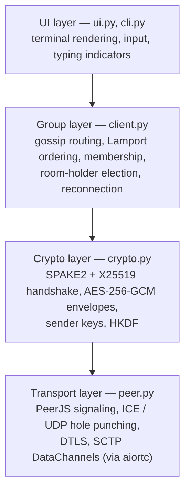
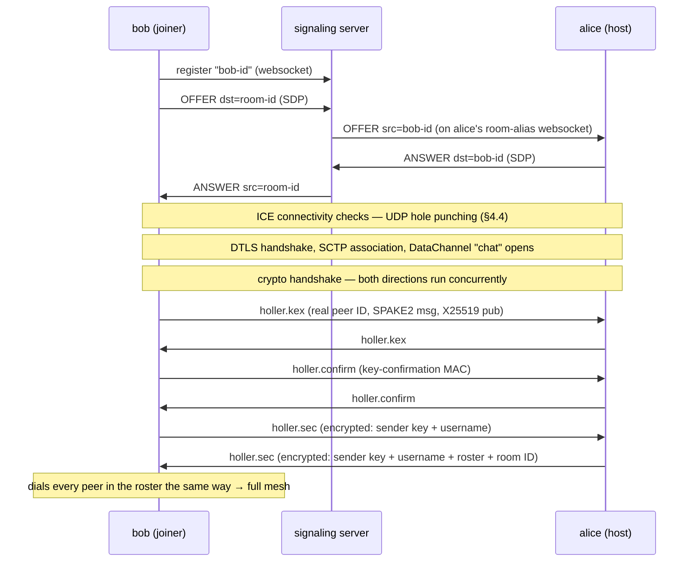
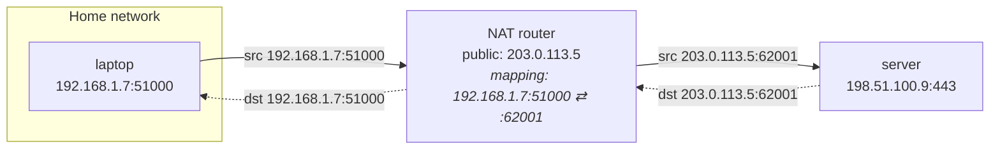
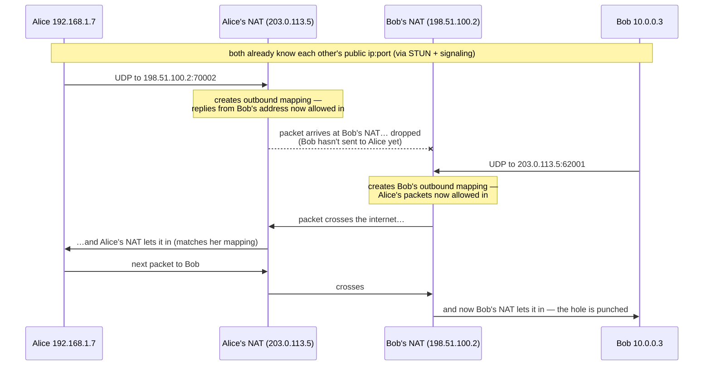
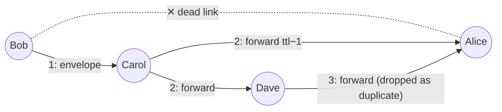
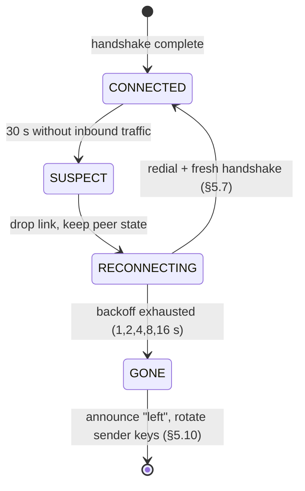

# The Holler Guide

**Everything you need to understand, run, and hack on holler — from first principles.**

This guide assumes you are a software engineer but assumes **zero background in
cryptography, networking internals, or distributed systems**. Every algorithm the app
uses is explained from the ground up: what problem it solves, how it works, why *this*
algorithm was chosen for *this* layer, and — where it's illuminating — a proof or proof
sketch of why it's correct. References for going deeper are at the end of every section
and collected in [§8](#8-where-to-learn-more).

---

## Table of contents

1. [Quick start](#1-quick-start)
2. [The big picture](#2-the-big-picture)
3. [A tour of the codebase](#3-a-tour-of-the-codebase)
4. [Networking: getting two machines to talk directly](#4-networking-getting-two-machines-to-talk-directly)
   - [4.1 The problem: NAT](#41-the-problem-nat)
   - [4.2 NAT behaviours: cone vs. symmetric](#42-nat-behaviours-cone-vs-symmetric)
   - [4.3 STUN: learning your own public address](#43-stun-learning-your-own-public-address)
   - [4.4 UDP hole punching, step by step](#44-udp-hole-punching-step-by-step)
   - [4.5 Why UDP and not TCP](#45-why-udp-and-not-tcp)
   - [4.6 TURN: the relay of last resort](#46-turn-the-relay-of-last-resort)
   - [4.7 ICE: hole punching, systematised](#47-ice-hole-punching-systematised)
   - [4.8 The WebRTC stack: SDP, DTLS, SCTP](#48-the-webrtc-stack-sdp-dtls-sctp)
   - [4.9 Signaling, PeerJS, and how holler implements all of this](#49-signaling-peerjs-and-how-holler-implements-all-of-this)
5. [Cryptography from first principles](#5-cryptography-from-first-principles)
   - [5.1 What we are defending against](#51-what-we-are-defending-against)
   - [5.2 Symmetric encryption: from XOR to AES](#52-symmetric-encryption-from-xor-to-aes)
   - [5.3 Integrity: message authentication codes](#53-integrity-message-authentication-codes)
   - [5.4 AEAD: AES-256-GCM and associated data](#54-aead-aes-256-gcm-and-associated-data)
   - [5.5 Key exchange: Diffie–Hellman, with proof](#55-key-exchange-diffiehellman-with-proof)
   - [5.6 The man-in-the-middle problem, and why passwords are hard](#56-the-man-in-the-middle-problem-and-why-passwords-are-hard)
   - [5.7 PAKE: SPAKE2, the algorithm that fixes passwords](#57-pake-spake2-the-algorithm-that-fixes-passwords)
   - [5.8 HKDF: turning secrets into keys](#58-hkdf-turning-secrets-into-keys)
   - [5.9 Forward secrecy](#59-forward-secrecy)
   - [5.10 Group encryption: sender keys and rotation](#510-group-encryption-sender-keys-and-rotation)
   - [5.11 Every layer, every algorithm, and why](#511-every-layer-every-algorithm-and-why)
6. [Distributed algorithms](#6-distributed-algorithms)
   - [6.1 Gossip: surviving dead links, with proof](#61-gossip-surviving-dead-links-with-proof)
   - [6.2 Ordering: Lamport clocks, with proof](#62-ordering-lamport-clocks-with-proof)
   - [6.3 Failure detection: heartbeats and their limits](#63-failure-detection-heartbeats-and-their-limits)
   - [6.4 Room-holder election](#64-room-holder-election)
7. [Threat model and honest limitations](#7-threat-model-and-honest-limitations)
8. [Where to learn more](#8-where-to-learn-more)

---

## 1. Quick start

Holler needs Python 3.10+ and [uv](https://docs.astral.sh/uv/getting-started/installation/).

```bash
git clone https://github.com/SipanP/holler
cd holler
uv sync
```

**Start a room** (you'll be prompted for a password — it never appears in your shell
history or `ps` output):

```bash
uv run holler alice
# Room password: ********
# Room ID: xk92mq3v7bt1
```

**Join from other terminals/machines**, using the same password:

```bash
uv run holler bob --join xk92mq3v7bt1
uv run holler carol --join xk92mq3v7bt1
```

Inside the chat: type and press Enter to send, `/who` lists who is online, `/quit`
(or `q`) exits. A toolbar at the bottom shows who is typing.

**Options:**

| Flag | Purpose |
|------|---------|
| `--join ROOM_ID` / `-j` | Join an existing room instead of creating one |
| `--signaling URL` | Use your own PeerJS-compatible signaling server (see [§4.9](#49-signaling-peerjs-and-how-holler-implements-all-of-this)) |
| `--stun URL` | Override the STUN server (default: Google's public STUN) |
| `--turn URL --turn-user U --turn-pass P` | Add a TURN relay for networks where hole punching fails (see [§4.6](#46-turn-the-relay-of-last-resort)) |

**For development:**

```bash
uv sync --group dev
uv run pytest        # 22 unit + integration tests, no network needed
uv run ruff check .
uv run pyright
uv run python tests/e2e_smoke.py   # live test against a real signaling server
```

---

## 2. The big picture

Holler is a group chat where **no server can read, store, or forge your messages**.
Every participant's terminal connects *directly* to every other participant's terminal.
A tiny public "signaling" server is used for a few seconds to help peers find each
other — after that it is out of the picture entirely.

Getting there requires solving four independent problems, and the codebase is layered
around exactly those four:



| Problem | Solution | Section |
|---|---|---|
| Two machines behind home routers cannot accept connections | UDP hole punching, coordinated by ICE/STUN, wrapped in WebRTC | [§4](#4-networking-getting-two-machines-to-talk-directly) |
| Nobody but the group may read messages — not even the signaling server | A password-authenticated key exchange (SPAKE2) plus authenticated encryption (AES-256-GCM) | [§5](#5-cryptography-from-first-principles) |
| Links die; messages must still arrive, in a sensible order | Gossip flooding + Lamport clocks + heartbeat-driven reconnection | [§6](#6-distributed-algorithms) |
| A terminal app must stay usable while all this happens | An event-driven headless client with a prompt_toolkit front-end | [§3](#3-a-tour-of-the-codebase) |

---

## 3. A tour of the codebase

```
src/holler/
├── cli.py      # argument parsing, password prompt, wiring — ~60 lines
├── ui.py       # terminal front-end (prompt_toolkit + rich)
├── client.py   # the heart: Client — handshakes, gossip, membership, resilience
├── peer.py     # transport: PeerJS signaling + WebRTC connections (aiortc)
├── crypto.py   # primitives: PAKE handshake, AEAD seal/open, Lamport clock, seen-cache
└── errors.py   # typed exceptions
tests/
├── fakes.py        # in-memory fake transport implementing peer.py's interface
├── conftest.py     # fixtures: fast-timing clients wired to the fake transport
├── test_crypto.py  # unit tests for the primitives
├── test_client.py  # integration tests: real Clients over the fake transport
└── e2e_smoke.py    # live test against a real signaling server (not collected by pytest)
```

### The two central classes

**`peer.PeerConnection`** owns everything below encryption. It registers IDs with the
signaling server (one websocket per registered ID, each supervised with keepalives and
automatic reconnection), performs WebRTC offer/answer, and hands the layers above an
extremely small surface: `connect_to(id)`, `send_to(id, str)`, `broadcast(str)`,
`drop(id)`, and four callbacks (`on_message`, `on_peer_connected`,
`on_peer_disconnected`, `on_alias_lost`). It knows nothing about encryption or chat.

**`client.Client`** owns everything above the transport. It runs the cryptographic
handshake with every new channel, encrypts/decrypts and routes gossip envelopes,
tracks membership, elects the room holder, detects dead links and reconnects. It is
**headless**: all output is emitted through a single `on_event(kind, payload)`
callback, which is what makes the whole thing testable — the test suite runs real
`Client` instances over an in-memory fake transport and asserts on the events.

### Life of a join, end to end



### Life of a message

Sending (`Client.send_chat`): tick the Lamport clock → seal
`{text, wall-clock}` with **our** sender key using AES-256-GCM, binding the envelope
metadata (message ID, origin, Lamport time, kind) as associated data → record the
message ID in our own seen-cache → send the envelope on every ready channel.

Receiving (`Client._handle_gossip`): validate the envelope shape → drop if the
message ID is in the seen-cache (deduplication) → merge the Lamport timestamp →
decrypt with the *origin's* sender key → **re-broadcast to every other channel with
TTL−1** (this is the gossip step that routes around dead links) → insert into the
log sorted by `(lamport, origin)` and emit a `chat` event for the UI.

### The background monitor

One task per client wakes every few seconds and does four cheap jobs: send a
`holler.ping` on every channel, mark links whose last inbound message is too old as
dead (starting the reconnection flow, [§6.3](#63-failure-detection-heartbeats-and-their-limits)),
expire stale typing indicators, and re-run the room-holder election
([§6.4](#64-room-holder-election)) so a lost room registration heals itself.

---

## 4. Networking: getting two machines to talk directly

### 4.1 The problem: NAT

The internet has ~4.3 billion IPv4 addresses and far more devices than that. The
workaround, deployed in practically every home and office router, is **Network Address
Translation (NAT)**: your whole network shares one public IP address, and your machines
get private addresses (`192.168.x.x`, `10.x.x.x`) that are meaningless outside.

When your laptop (`192.168.1.7`) sends a UDP packet from its local port `51000` to a
server, the router **rewrites** the source address to its own public IP and some port
it picks (say `203.0.113.5:62001`), and remembers the mapping:



Replies to `203.0.113.5:62001` are translated back and delivered to the laptop. But
here is the crucial property: **the mapping only exists because the laptop sent
something first**. An unsolicited packet from a stranger arrives at the router with no
matching mapping and is silently dropped. That is why "just listen on a port" doesn't
work for a P2P app — *both* peers are behind NATs, *neither* can accept an incoming
connection, and (a design constraint of holler) we never require accepting inbound TCP.

NAT is a router feature, not a protocol you can negotiate with. Everything in this
section is a technique for *tricking* two NATs into each thinking their own machine
started the conversation.

### 4.2 NAT behaviours: cone vs. symmetric

NATs differ in one detail that decides whether hole punching works: **how they choose
the public port, and who is allowed to send to it**.

- **Endpoint-independent mapping ("cone" NAT)** — the router reuses *the same* public
  port for a given internal `ip:port`, no matter where the traffic is going. Once
  `laptop:51000 → :62001` exists, packets the laptop sends to *anyone* leave from
  `:62001`. Filtering may still be restricted (only hosts you've already sent to may
  reply), but the *address* is stable and therefore shareable.
- **Endpoint-dependent mapping ("symmetric" NAT)** — the router allocates a *different*
  public port per destination. The port a STUN server observes is not the port your
  packets toward a peer will use, so telling the peer your STUN-observed address is
  useless. Common on corporate networks and some mobile carriers.

Hole punching (next two sections) works for cone NATs — the substantial majority of
home networks — and fails for symmetric ones, which is exactly why TURN
([§4.6](#46-turn-the-relay-of-last-resort)) exists.

### 4.3 STUN: learning your own public address

Your machine does not know what public `ip:port` its NAT assigned — the rewriting
happens outside it. **STUN** (Session Traversal Utilities for NAT, RFC 8489) is a
protocol of almost comic simplicity that fixes this: you send a UDP *Binding Request*
to a public STUN server, and the server replies with one piece of information — *the
source address it saw your packet come from*. That is, by construction, your public
mapping for this socket.

```
you → STUN server:   "what do I look like from out there?"
STUN server → you:   "203.0.113.5:62001"
```

An address learned this way is called a **server-reflexive candidate**. Holler uses
Google's free public STUN server by default (`stun:stun.l.google.com:19302`,
overridable with `--stun`). STUN servers are stateless, handle one round trip per
query, and see no user data — running your own is trivial.

### 4.4 UDP hole punching, step by step

Now the trick itself. Alice and Bob are both behind cone NATs. Both have learned their
public addresses via STUN, and have exchanged them through the signaling server
(which they *can* both reach, because outbound connections always work).



Why this works, reasoned from the NAT's point of view: a NAT's job is to let *replies*
in. It cannot actually tell a reply from an unsolicited packet — all it checks is
"did my host recently send a packet to this remote `ip:port` from this local port?".
So when **both sides transmit at roughly the same time**, each side's first packet
plays the role of "opening the door" (creating the outbound mapping) and each side's
*subsequent* packets play the role of "replies" that fit through the other's open
door. The first packet in each direction is typically lost — that is expected and
harmless, because both sides keep retransmitting until one gets through.

Three practical notes:

1. **Timing needs coordinating.** Both sides must be trying at once — which is
   precisely what the signaling server arranges (it delivers the "start now, here are
   my addresses" messages).
2. **Mappings expire.** NATs forget idle UDP mappings after seconds to minutes, which
   is one of the two reasons holler heartbeats every open channel forever
   ([§6.3](#63-failure-detection-heartbeats-and-their-limits)) — the traffic keeps the
   hole open.
3. **Same-network shortcut.** If both peers are on the same LAN, their *private*
   addresses work directly; hole punching machinery still runs but the local route
   wins. This is why candidates of several types are tried in parallel
   ([§4.7](#47-ice-hole-punching-systematised)).

### 4.5 Why UDP and not TCP

TCP's handshake is stateful and asymmetric: one side `listen()`s, the other
`connect()`s, and the kernel tracks sequence numbers from the first SYN. Punching a
hole requires *both* sides to initiate simultaneously, which in TCP-land means a
"simultaneous open" — a rarely-exercised corner of the protocol that many NATs and
OS stacks handle badly. UDP has no connection state at all: a mapping is just
"forward things that look like replies", which is trivially compatible with both
sides blasting packets at each other.

So the entire P2P world (WebRTC included) settled on: **punch with UDP, then build
reliability on top of it in userspace**. Reliability, ordering, and congestion
control come back at a higher layer — in WebRTC's case via SCTP
([§4.8](#48-the-webrtc-stack-sdp-dtls-sctp)). This also satisfies holler's design
constraint that peers never accept inbound TCP.

### 4.6 TURN: the relay of last resort

When at least one side is behind a symmetric NAT ([§4.2](#42-nat-behaviours-cone-vs-symmetric)),
punching fails — there is no stable public address to share. The fallback is **TURN**
(Traversal Using Relays around NAT, RFC 8656): a server that both peers connect *out*
to, which relays their traffic. This sacrifices the "no server in the message path"
property for that connection — but crucially **not confidentiality**: everything a
TURN server relays is DTLS ciphertext, and inside that, holler's own AES-GCM
ciphertext. The relay learns who talks to whom and how much, never what.

Holler does not ship a default TURN server (running a relay costs real bandwidth);
you pass your own with `--turn turn:your.server:3478 --turn-user u --turn-pass p`.
[coturn](https://github.com/coturn/coturn) on a small VPS is the standard choice.
TURN-over-TCP exists but holler deliberately configures relays over UDP only, keeping
the no-inbound-TCP constraint intact.

### 4.7 ICE: hole punching, systematised

Real networks are messy: maybe you're on the same LAN, maybe one side has a public IP,
maybe punching works, maybe only TURN does. **ICE** (Interactive Connectivity
Establishment, RFC 8445) is the algorithm that tries everything and picks the best
thing that works:

1. **Gather candidates** — each peer collects every address it might be reachable at:
   - *host* candidates (its own interface addresses — work on the same LAN),
   - *server-reflexive* candidates (public addresses learned via STUN, [§4.3](#43-stun-learning-your-own-public-address)),
   - *relayed* candidates (TURN allocations, if configured).
2. **Exchange them** through the signaling channel.
3. **Connectivity checks** — form all candidate pairs, sort by priority
   (host > reflexive > relayed), and send STUN Binding Requests directly between the
   pair addresses. **These probe packets, fired by both sides at once, are the UDP
   hole punching of §4.4** — ICE is not an alternative to hole punching, it *is* hole
   punching plus bookkeeping.
4. **Nominate** — the first/best pair whose check succeeds in both directions becomes
   the path; everything else is torn down.

### 4.8 The WebRTC stack: SDP, DTLS, SCTP

WebRTC bundles the whole stack above and adds transport security and reliability.
Holler uses [aiortc](https://github.com/aiortc/aiortc), a Python implementation.
From the bottom up, a holler DataChannel is:

```
UDP                      ← what actually crosses the NATs (§4.4)
 └─ ICE                  ← path selection & keepalive of the punched hole (§4.7)
     └─ DTLS             ← TLS for datagrams: encrypts everything above (§5.11)
         └─ SCTP         ← reliability, ordering, multiplexing — TCP-like semantics in userspace
             └─ DataChannel "chat"   ← the message pipe holler reads/writes
```

- **SDP** (Session Description Protocol) is the *offer/answer* document peers exchange
  through signaling: it lists ICE candidates, the DTLS certificate fingerprint, and
  SCTP parameters. Holler waits for ICE gathering to finish and sends one complete SDP
  per direction ("vanilla ICE") rather than trickling candidates one by one — slightly
  slower to connect, much simpler to relay through PeerJS.
- **DTLS** is TLS adapted to datagrams. Each peer generates a throwaway self-signed
  certificate; its fingerprint travels inside the SDP. That means DTLS's authenticity
  is only as trustworthy as the signaling channel that carried the fingerprint — the
  precise gap holler's own crypto layer closes ([§5.6](#56-the-man-in-the-middle-problem-and-why-passwords-are-hard)).
- **SCTP** gives back what UDP took away — retransmission, in-order delivery,
  message framing — without needing OS/NAT cooperation, because it runs *inside* the
  DTLS packets in userspace.

### 4.9 Signaling, PeerJS, and how holler implements all of this

Two peers can't exchange SDPs over a connection that doesn't exist yet — someone
reachable-by-both must carry the first few messages. That someone is the **signaling
server**. Holler speaks the open [PeerJS](https://peerjs.com/) protocol: each peer
opens a websocket and registers an ID; the server's only job is forwarding small JSON
envelopes (`OFFER`, `ANSWER`, heartbeats) between IDs. It is on the path for a few
seconds per connection and never sees anything but SDPs — and thanks to SPAKE2
([§5.7](#57-pake-spake2-the-algorithm-that-fixes-passwords)), even a *malicious*
signaling server cannot break into the chat.

Everything in this section lives in **`src/holler/peer.py`**:

| Concern | Where | Notes |
|---|---|---|
| Candidate/STUN/TURN config | `build_ice_servers()` | fed to aiortc's `RTCConfiguration`; `--stun`/`--turn` flags land here |
| Vanilla ICE | `_wait_for_ice()` | block until gathering completes, then ship one SDP |
| Offer/answer | `_send_offer()`, `_handle_offer()`, `_handle_answer()` | plus a deterministic tie-break when both sides dial simultaneously ("glare"): the lexicographically lower peer ID stays the offerer |
| Registration keepalive | `_heartbeat()` | the PeerJS server expires clients that don't ping every few seconds — the *client* must send heartbeats |
| Signaling resilience | `_supervise()` | every registered ID's websocket auto-reconnects with exponential backoff and re-registers |
| Fast failure | `_fail_pending()` | a `LEAVE`/`EXPIRE` from the server immediately fails a pending dial instead of waiting out a 30 s timeout |
| **Room IDs** | `register_alias()` | the trick that gives holler stable rooms: the room ID is just a *second* PeerJS registration held by one member. Offers addressed to the room land on whichever peer holds it. Who holds it is decided by the election in [§6.4](#64-room-holder-election) |

The public `0.peerjs.com` server is the default so that holler works out of the box,
but `--signaling` accepts any PeerJS-compatible server — self-hosting is one line
(`npx peer --port 9000`) and removes the third-party dependency and its metadata view
([§7](#7-threat-model-and-honest-limitations)).

> **Go deeper:** Ford, Srisuresh & Kegel, *Peer-to-Peer Communication Across Network
> Address Translators* (2005) — the classic hole-punching paper. Tailscale's
> [*How NAT traversal works*](https://tailscale.com/blog/how-nat-traversal-works) —
> the best modern treatment. [*WebRTC for the Curious*](https://webrtcforthecurious.com/)
> — a free book on the whole stack. RFCs: 8445 (ICE), 8489 (STUN), 8656 (TURN),
> 8831 (data channels).

---

## 5. Cryptography from first principles

### 5.1 What we are defending against

Cryptography starts by naming the enemy. Holler's adversary is allowed to:

- read **every packet** on the network (your ISP, a coffee-shop Wi-Fi operator);
- **modify, drop, replay, or inject** packets (an "active" attacker);
- **run the signaling server** (we treat `0.peerjs.com` as potentially hostile);
- join the mesh and behave maliciously *if* they know the password.

The one thing the adversary does not have is the room password. Three classical goals,
against that adversary:

- **Confidentiality** — they can't read messages.
- **Integrity** — they can't alter messages without detection.
- **Authenticity** — they can't impersonate a group member.

A principle worth internalising immediately (**Kerckhoffs' principle**, 1883): a system
must be secure even if the attacker knows *everything about it except the keys*. All
of holler's algorithms are public and standard; every drop of secrecy lives in keys
and the password. Home-grown ciphers are how projects get broken — the craft is in
*composing* well-studied primitives correctly, which is what this section walks
through.

### 5.2 Symmetric encryption: from XOR to AES

Start with the simplest cipher that is actually *perfect*. XOR (`⊕`) is bitwise
addition without carry; its key property is that it undoes itself:
`(m ⊕ k) ⊕ k = m ⊕ (k ⊕ k) = m ⊕ 0 = m`.

**One-time pad:** to encrypt message `m`, generate a random key `k` *as long as the
message* and send `c = m ⊕ k`. Claude Shannon proved (1949) this has *perfect
secrecy*: for any ciphertext `c` and any candidate message `m′` of the same length,
there exists exactly one key (`k′ = c ⊕ m′`) producing it — so `c` reveals literally
nothing about which message was sent. Two catches make it impractical: the key must be
as long as all traffic ever, and **reusing a pad is fatal** — from `c₁ = m₁ ⊕ k` and
`c₂ = m₂ ⊕ k` anyone computes `c₁ ⊕ c₂ = m₁ ⊕ m₂`, which is usually enough to recover
both messages. Remember this failure; it returns as the *nonce reuse* rule in §5.4.

Real systems therefore use a **block cipher**: a fixed, public, invertible scrambling
function selected by a short key. **AES** (the Advanced Encryption Standard, selected
by open international competition in 2001) maps a 16-byte block to a 16-byte block
under a 128/192/256-bit key, and after a quarter century of cryptanalysis the best
known attacks are marginal. The working assumption: without the key, AES's output is
indistinguishable from random.

A block cipher alone encrypts exactly 16 bytes. A **mode of operation** extends it to
arbitrary messages. The mode holler relies on is **CTR (counter) mode**: encrypt the
sequence `nonce‖0, nonce‖1, nonce‖2, …` with AES to produce a pseudorandom *keystream*,
and XOR it with the message — a one-time pad whose "pad" is generated from 32 bytes of
key. The one-time-pad rule carries over exactly: **the same key+nonce must never be
used twice**.

The older mode you'll meet in the wild, **CBC** (chain each block into the next),
works but has sharp edges: it needs padding to a block boundary, and the history of
"padding oracle" attacks (§5.4) is the history of CBC deployments.

### 5.3 Integrity: message authentication codes

Encryption alone does **not** stop tampering — this surprises everyone at first. In
CTR mode, flipping bit *i* of the ciphertext flips exactly bit *i* of the decrypted
plaintext (XOR is bitwise): an attacker who knows a message says `pay alice 10` can
flip the right bits to make it decrypt to `pay mALEX 10` *without any idea what the
key is*. Ciphertexts are malleable; secrecy and integrity are separate properties.

The tool for integrity is a **MAC** (message authentication code): a function
`MAC(key, message) → tag` such that, without the key, no attacker can produce a valid
tag for any new message — even after seeing tags for messages of their choosing
(*existential unforgeability*). The standard construction over a hash function is
**HMAC** (`HMAC(k, m) = H((k⊕opad) ‖ H((k⊕ipad) ‖ m))`), whose security reduces to
mild assumptions on the hash.

Holler uses HMAC-SHA256 directly in one place — the handshake's key-confirmation MAC
([§5.7](#57-pake-spake2-the-algorithm-that-fixes-passwords)) — and everywhere else
gets MAC-like integrity bundled inside AES-GCM, next.

One subtlety worth knowing because it generalises: when *checking* a MAC, comparing
byte-by-byte with early exit (`==`) leaks *how many leading bytes were right* through
timing, which lets an attacker forge a tag byte at a time. Comparisons of secrets must
be constant-time — hence `hmac.compare_digest` in `crypto.py`.

### 5.4 AEAD: AES-256-GCM and associated data

Combining a cipher and a MAC yourself invites ordering mistakes (encrypt-then-MAC vs
MAC-then-encrypt — only the former is generically safe). Modern practice merges them
into one primitive: **AEAD**, *authenticated encryption with associated data*. Holler
uses **AES-256-GCM** for every envelope. GCM =

- **CTR mode** (§5.2) for confidentiality, plus
- **GHASH**, a polynomial-evaluation MAC over the ciphertext *and* over any
  **associated data (AAD)** — bytes that are *authenticated but not encrypted*.

Decryption verifies the tag *before* releasing a single byte of plaintext; a tampered
ciphertext, a wrong key, or mismatched AAD all yield one indistinguishable error.

**AAD is the feature holler leans on hardest.** A gossip envelope
([§6.1](#61-gossip-surviving-dead-links-with-proof)) travels through *other people's
clients*, which must read its routing metadata (message ID, origin, Lamport timestamp,
kind) to forward it. That metadata can't be encrypted — but it must not be forgeable,
or a relay could re-attribute a message to another user or shuffle timestamps. So
`client.py` binds exactly that metadata as AAD:

```python
aad = f"holler.gossip:{msg_id}:{origin}:{lamport}:{kind}"
blob = seal(sender_key, plaintext, aad)      # crypto.py
```

If any relay alters any of those fields, every recipient's tag check fails and the
message is dropped. One line of AAD replaces an entire signature scheme *within the
group's trust model* (a member's identity is vouched for by possession of their sender
key, which only the password-authenticated handshake distributes).

**The nonce rule, quantified.** GCM nonces are 96 bits and holler draws them at
random per message (`crypto.seal`). Reusing a key+nonce pair is catastrophic (it XORs
keystreams like a reused one-time pad *and* leaks the MAC key — Joux's "forbidden
attack"), so it's worth checking the arithmetic: by the birthday bound, after `q`
messages under one key the collision probability is ≈ `q²/2⁹⁷`. At an absurd million
messages per second for a year (`q ≈ 2⁴⁵`), that's ≈ `2⁻⁷` — and holler additionally
rotates sender keys on every membership change (§5.10), resetting `q`. Safe with
orders of magnitude to spare.

**Why AES-256-GCM here, and not…**

- *Fernet* (what holler v1 used): AES-128-CBC + HMAC — a sound encrypt-then-MAC
  design, but it has **no AAD**, uses 128-bit keys, and CBC's padding invites the
  classic **padding oracle** failure mode (Vaudenay 2002: if an attacker can merely
  *distinguish* "bad padding" from "bad data" errors, CBC decrypts completely — the
  bug class behind POODLE and Lucky13). The AAD gap alone forced the change: the
  gossip envelope design is impossible with Fernet.
- *ChaCha20-Poly1305*: the equally good modern alternative; faster on CPUs without
  AES hardware. Either would do; AES-GCM was chosen for ubiquity (it's also what the
  DTLS layer negotiates, keeping the stack's assumptions uniform).

### 5.5 Key exchange: Diffie–Hellman, with proof

Everything so far assumed a shared key. The magic trick at the heart of all modern
secure channels is establishing one **over a wire the adversary is reading**.

**Diffie–Hellman (1976), in plain integers.** Fix public parameters: a large prime
`p` and a generator `g`. ("Generator" means powers of `g` mod `p` cycle through the
whole group — every element is `gᵏ` for some `k`.)

1. Alice picks a random secret `a`, sends **A = gᵃ mod p**.
2. Bob picks a random secret `b`, sends **B = gᵇ mod p**.
3. Alice computes `Bᵃ`; Bob computes `Aᵇ`.

**Correctness (a real proof, two lines):** exponentiation composes multiplicatively —
`(gᵇ)ᵃ = g^{ba} = g^{ab} = (gᵃ)ᵇ (mod p)`, by writing out the product of `ab` copies
of `g` and reordering (multiplication mod p is commutative and associative). ∎
Both parties hold the same value `K = g^{ab}` having only ever transmitted `gᵃ` and
`gᵇ`.

**Security (why the eavesdropper is stuck):** recovering `a` from `gᵃ mod p` is the
**discrete logarithm problem** — for well-chosen 2048-bit-plus groups, no known
algorithm runs in feasible time. What security actually rests on is the (slightly
stronger, unproven but 50-years-unbroken) **computational Diffie–Hellman assumption**:
given `g, gᵃ, gᵇ` it is infeasible to compute `g^{ab}`. Unlike the correctness proof,
this is an *assumption* — all of public-key cryptography rests on such assumptions,
which is why parameter choices follow decades of cryptanalysis rather than taste.

**Elliptic curves, and why X25519.** The same algebra works in any group where
"exponentiation" is easy but "logarithm" is hard. Points on an **elliptic curve** form
such a group, and their discrete-log problem is *much* harder per bit: 256-bit curve
keys ≈ 3072-bit classic DH keys, with far cheaper computation. Holler uses **X25519**
(RFC 7748), the DH function over Curve25519, for reasons that go beyond size:

- **Misuse-resistant by design** — every 32-byte string is a valid public key; there
  are no parameter or point-validation mistakes to make (a real attack class against
  older NIST-curve implementations: invalid-curve and twist attacks).
- **Constant-time by construction** (the Montgomery ladder), closing the timing
  side channel of §5.3 at the key-exchange layer too.
- Independently designed with published rationale (Bernstein 2006), and the de facto
  standard in Signal, WireGuard, TLS 1.3, and SSH.

In holler, each peer generates a **fresh X25519 key pair per connection** — that
"ephemeral" choice is what buys forward secrecy (§5.9).

### 5.6 The man-in-the-middle problem, and why passwords are hard

DH has a hole the maths cannot fix: it agrees a key with *whoever is on the other
end*. An active attacker **M** sitting between Alice and Bob (say, a malicious
signaling server — the exact position `0.peerjs.com` occupies) simply runs *two* DH
exchanges — one with each victim — and re-encrypts traffic in the middle, reading
everything. Neither victim can tell: they each completed a perfectly valid exchange.

The web solves this with certificates; holler's DTLS layer can't (its certificate
fingerprints travel *through the untrusted signaling server* — a MITM swaps them). A
serverless group of friends has exactly one shared secret to authenticate with: **the
room password**. And passwords are dangerous, because they're *guessable*, so the
design question becomes: *can an attacker test password guesses, and at what cost?*

Here is the cautionary tale, and it's holler's own v1 design. It derived the pairwise
key as `key = HKDF(dh_secret ‖ password)` and immediately used it to encrypt a
message with an authenticated cipher. Consider the MITM above: M runs a DH exchange
with Alice, so **M knows `dh_secret`** (it's M's own exchange!). Alice then sends
`Enc(HKDF(dh_secret ‖ password), …)`. Now M walks away and, entirely on its own
hardware, for each candidate password `pw′` computes `HKDF(dh_secret ‖ pw′)` and
tries to decrypt — the AEAD tag check ([§5.4](#54-aead-aes-256-gcm-and-associated-data))
says definitively whether the guess was right. That is an **offline dictionary
attack**: a modern GPU rig tests billions of guesses per second against the roughly
2⁴⁰-guess space of human-chosen passwords. One intercepted handshake ≈ password
recovered overnight.

The fix requires a genuinely clever primitive.

### 5.7 PAKE: SPAKE2, the algorithm that fixes passwords

A **PAKE** (password-authenticated key exchange) achieves something that sounds
impossible: two parties agree on a strong key using a weak password, such that an
attacker — even an *active* MITM — gets **at most one online password guess per
protocol run**, and a transcript is useless for offline grinding. Holler uses
**SPAKE2** (Abdalla–Pointcheval 2005; RFC 9382), in its symmetric variant, implemented
by the [`python-spake2`](https://github.com/warner/python-spake2) library over the
Ed25519 group.

**The construction.** Work in a prime-order group with generator `g` (as in §5.5,
but on an elliptic curve). The protocol fixes one extra public group element `S`
whose discrete log nobody knows (a "nothing-up-my-sleeve" constant). Derive from the
password a scalar `w = H(password)`. Then, with `x, y` random:

```
Alice → Bob:   X = gˣ · Sʷ         (her DH share, *blinded* by the password)
Bob → Alice:   Y = gʸ · Sʷ

Alice:  K = (Y / Sʷ)ˣ  = (gʸ)ˣ = g^{xy}
Bob:    K = (X / Sʷ)ʸ  = (gˣ)ʸ = g^{xy}
session key = H(transcript ‖ w ‖ K)
```

**Correctness proof:** `Y / Sʷ = gʸ·Sʷ·S⁻ʷ = gʸ`, so Alice computes `(gʸ)ˣ = g^{xy}`;
symmetrically Bob gets `g^{xy}` — the blinding factors cancel *iff both used the same
`w`*, i.e. the same password. ∎ (With different passwords nothing breaks visibly —
the two sides just end up with different keys, which is why an explicit confirmation
step follows.)

**Why a transcript is useless offline (the beautiful part):** consider an
eavesdropper holding `X = gˣ·Sʷ` and testing a candidate password `w′`. Unblinding
gives `X/S^{w′} = g^{x}·S^{w-w′}` — *some* group element. But since `x` is uniformly
random and `g` generates the whole group, `gˣ` is a uniformly random element, so `X`
itself is uniformly distributed **whatever `w` is**. Every candidate password is
perfectly consistent with the observed transcript; there is nothing to check a guess
against. To *test* `w′` you must compute `g^{xy}` from the unblinded shares — which is
exactly the computational Diffie–Hellman problem (§5.5) unless you personally chose
`x` or `y`. And that is the online-only loophole, precisely as intended: an active
attacker can pick their own `y`, guess `w′`, run the protocol once, and see if the
confirmation MAC verifies — **one guess, per run, visible to the victim as a failed
join**. Guessing a decent password now takes billions of *interactive sessions with a
human-noticeable failure each*, instead of a quiet weekend of GPU time.

**Key confirmation, and a subtle reflection trap.** SPAKE2's `finish()` always
outputs *a* key; to turn "wrong password" into a loud, immediate error, both sides
exchange `HMAC(confirm_key, own_peer_id)` and verify the peer's
(`crypto.PairwiseCrypto.confirmation`). MAC'ing over each side's *own ID* makes the
two directions' proofs different values — otherwise an attacker could simply **echo
your own proof back at you** ("reflection") and pass verification knowing nothing.
Wrong password ⇒ different `K` ⇒ MAC mismatch ⇒ `AuthenticationError` within one
round trip. This is the mechanism behind holler failing fast and loudly on a typo'd
password.

**Belt and braces:** holler still runs a plain ephemeral X25519 exchange alongside
and mixes both into the session key, `HKDF(x25519_secret ‖ spake2_key)` — if a flaw
were ever found in either primitive, the other still stands alone.

**Why SPAKE2 and not the alternatives?**

- *SRP* (the older, widely deployed PAKE): designed for client↔server with a stored
  verifier; requires assigning asymmetric roles (awkward between equal peers), has
  legacy structural warts (it needs special "safe prime" groups and resists analysis
  in modern frameworks), and its maintained Python implementations lag.
  SPAKE2's symmetric variant needs no role negotiation at all — both peers run
  byte-identical code, which matters in a mesh where connections race in both
  directions.
- *OPAQUE* (the state of the art for client↔server logins): solves the problem of the
  *server* storing something crackable — irrelevant here, where nobody stores anything.
- *Doing nothing* (v1's HKDF mixing): broken by §5.6.

### 5.8 HKDF: turning secrets into keys

A recurring chore: you hold some high-entropy-but-oddly-shaped secret (a DH point, a
concatenation of two secrets) and need uniform, independent keys for specific jobs.
Using raw secrets directly, or one key for two purposes, is how related-key bugs
happen. **HKDF** (RFC 5869) is the standard answer, built entirely from HMAC in two
steps: **extract** (concentrate the input's entropy into one uniform key) then
**expand** (stretch it into any number of output keys, each labelled by an `info`
string). Distinct labels yield computationally independent keys.

Every derivation in holler goes through `crypto._hkdf` with a distinct label —
`"holler-pairwise"` for the session key, `"holler-confirm"` for the confirmation-MAC
key — plus versioned AAD-style labels on every envelope (`"holler.sec:…"`,
`"holler.rekey:…"`, `"holler.gossip:…"`). This *domain separation* guarantees that a
ciphertext or MAC produced in one context can never be replayed as valid in another.

### 5.9 Forward secrecy

Question worth asking of any encrypted system: *if my long-term secret leaks tomorrow,
what happens to yesterday's traffic?* If the answer is "decryptable", an adversary can
record ciphertext today and wait.

Holler's only long-term secret is the password, and the answer is "nothing happens":
session keys derive from **ephemeral** X25519/SPAKE2 values (`x`, `y`) that are
generated per connection, live only in RAM, and are destroyed on disconnect. A future
password thief holds transcripts of the form `gˣ·Sʷ` and AEAD ciphertext; without the
long-gone `x` or `y`, computing the session key is still the CDH problem (§5.5) —
knowing `w` doesn't help. That property is **forward secrecy**. (Its mirror,
*post-compromise security* — healing after a device compromise — is what sender-key
rotation partially provides, next.)

### 5.10 Group encryption: sender keys and rotation

Pairwise keys secure two-party links; a *group* needs a broadcast story. Three
standard designs, with their trade-offs:

1. **Encrypt per recipient** — N−1 encryptions and N−1 sends per message. Robust but
   quadratic traffic in the mesh; wasteful when a message is already being flooded.
2. **One shared group key** — one encryption per message, but *any* member can forge
   messages *as* any other member (everyone holds the only key), and every membership
   change forces a group-wide renegotiation.
3. **Sender keys** — each member generates their own random 32-byte AES key at
   session start and hands it to every other member over the authenticated pairwise
   channels. Messages are encrypted **once** with the author's own key and flooded;
   everyone decrypts with their stored copy of the *author's* key.

Holler uses (3), the same pattern as Signal group chats. It keeps the flood-friendly
"encrypt once" property of a group key while restoring authenticity: successfully
decrypting an envelope with *Bob's* sender key (tag check and all, §5.4) proves it
was sealed by someone holding Bob's key — which the handshake only ever gave to Bob's
authenticated peers, and which the AAD binds to Bob's ID. A member cannot forge
another member's messages.

**Rotation:** whenever anyone leaves (gracefully or by timeout), every remaining
member generates a fresh sender key and re-distributes it over the pairwise channels
(`client._rotate_sender_key`, message type `holler.rekey`). A departed member's key
material therefore goes stale immediately — even if they somehow kept receiving
ciphertext, they could not read anything sent after their departure. Recipients keep
exactly one previous key per sender (`crypto.open_any` tries newest-first) so
messages in flight across a rotation aren't lost. New joiners, symmetrically, receive
only current keys and can read nothing from before they joined.

### 5.11 Every layer, every algorithm, and why

The complete inventory, bottom to top — note how each layer covers the one below's
known gap:

| Layer | Algorithm | What it protects | Why this one / known gap it leaves |
|---|---|---|---|
| Wire transport | **DTLS 1.2** (inside WebRTC, negotiated by aiortc) | everything on the wire from passive snooping | mandatory in WebRTC; free. **Gap:** its self-signed cert fingerprints ride through the untrusted signaling server → MITM-able there (§4.8) |
| Peer authentication | **SPAKE2** (Ed25519 group) + ephemeral **X25519**, mixed via HKDF | proves password knowledge; kills offline dictionary attacks by the MITM above | symmetric roles, modern analysis, maintained library; X25519 kept as independent second leg (§5.7) |
| Loud failure | **HMAC-SHA256** key confirmation over own peer ID | wrong password fails fast; blocks reflection | one HMAC each way; simplest possible mutual proof (§5.7) |
| Key derivation | **HKDF-SHA256** with per-purpose labels | independent keys per job; domain separation | the standard; nothing else is defensible (§5.8) |
| Handshake payloads & rekeys | **AES-256-GCM** under the pairwise key, purpose-labelled AAD | sender keys, usernames, roster in transit | AEAD needed anyway; one primitive everywhere (§5.4) |
| Group messages | **AES-256-GCM** under per-author **sender keys**; envelope metadata as AAD | confidentiality + unforgeable authorship + tamper-proof routing metadata through relays | encrypt-once for flooding; AAD is what makes gossip safe — Fernet's lack of AAD forced its retirement (§5.4, §5.10) |
| Membership change | **sender-key rotation** | leavers can't read the future | cheap post-compromise hygiene (§5.10) |
| Identifiers | `secrets`-based 62-bit room IDs, random 96-bit nonces, random per-message IDs | unguessable rooms; nonce safety; replay detection | CSPRNG only — Python's `random` is predictable from its outputs |

> **Go deeper:** Aumasson, *Serious Cryptography* (the right first book);
> Boneh & Shoup, *A Graduate Course in Applied Cryptography* (free, rigorous — the
> proofs here in full); the [Cryptopals challenges](https://cryptopals.com/) (you
> implement the padding-oracle and nonce-reuse attacks yourself — the fastest way to
> believe them); RFCs 7748 (X25519), 5869 (HKDF), 9382 (SPAKE2); NIST SP 800-38D (GCM).

---

## 6. Distributed algorithms

The crypto above secures *messages*; this section is about *the group* — how messages
reach everyone despite dead links, how everyone agrees what order things happened in,
and who holds the room ID. Holler is a real distributed system, just a friendly-sized
one.

### 6.1 Gossip: surviving dead links, with proof

Peers form a full mesh, but any individual link can silently die (NAT mapping
expired, Wi-Fi blip). If messages travelled only on the direct author→reader link, a
single dead link would silently split the conversation. Holler instead **floods**:

```
On receiving envelope e via link L:
  1. if e.id in seen-cache        → drop        (termination / dedup)
  2. add e.id to seen-cache
  3. attempt decrypt & deliver     (§5.10; failure to decrypt ⇒ drop, don't forward)
  4. if e.ttl > 1: forward e with ttl−1 to every ready link except L
```



**Theorem (delivery).** Model live links as an undirected graph `G`. If there is any
path from the author to peer `P` of length ≤ TTL, then `P` delivers the message
exactly once.

*Proof.* Induction on `d`, the length of the shortest author→P path.
Base `d = 1`: the author sends on all its links, including the one to `P`.
Step: assume every peer at distance `d` processes the envelope (first copy arrives
with TTL ≥ initial−d+1 > 1, by the same induction). `P` at distance `d+1` has a
neighbour `Q` at distance `d` on a shortest path; when `Q` processes its *first* copy,
step 4 forwards to all `Q`'s neighbours — including `P`. So `P` receives it. *Exactly
once* as in: later copies hit step 1 and are dropped; each peer therefore delivers and
forwards at most once. ∎

**Cost.** Each peer forwards once on each of its links, so one chat message causes at
most `2·|E|` transmissions — in a full mesh of `n` peers, O(n²) small packets. For a
chat room of humans (n ≤ dozens), negligible; this simplicity-over-bandwidth trade is
deliberate. (At thousands of nodes you'd switch to probabilistic gossip — forward to
`k` random neighbours — accepting probabilistic delivery for O(n log n) cost; see
Demers et al. below.)

**The details that make it safe in practice:**
- The **seen-cache** (`crypto.SeenCache`) is bounded — LRU by insertion with a time
  and size cap — so an unbounded set can't leak memory over a long session, and
  incidentally makes **replayed** envelopes (same ID) inert.
- **TTL = 8** bounds worst-case circulation of any single envelope. A full mesh has
  diameter 1; even after heavy link failure the surviving graph's diameter stays tiny,
  so 8 is generous headroom, not a tuning knob.
- **Decrypt-fail ⇒ don't forward**: a corrupted or forged envelope dies at the first
  honest hop rather than being amplified by the mesh (§5.4's AAD makes the check
  airtight).

### 6.2 Ordering: Lamport clocks, with proof

With gossip, the same two messages can arrive at different peers **in different
orders** (different paths, different delays). Wall clocks can't arbitrate — machines'
clocks disagree by amounts far larger than a chat's inter-message gaps. The classic
fix (Lamport, 1978 — the most-cited paper in distributed systems) is to stop asking
"when" and ask "**what could have caused what**".

Define the **happened-before** relation `→` as the smallest transitive relation where
`a → b` if `a` precedes `b` in the same process, or `a` is the sending of a message
and `b` its receipt. Events with neither `a → b` nor `b → a` are *concurrent* — and
for concurrent events, *any* display order is defensible; what's unacceptable is
peers disagreeing, or an answer displaying before its question.

**Lamport clock:** each peer keeps an integer `t`. On every send: `t += 1`, stamp the
message with `t` (`LamportClock.tick`). On every receive of stamp `s`:
`t = max(t, s) + 1` (`LamportClock.update`).

**Theorem (clock condition).** `a → b ⟹ C(a) < C(b)`.

*Proof.* It suffices to check the two generating cases, since `<` on integers is
transitive. (i) Same process: every local event increments `t`, so later events get
strictly larger stamps. (ii) Message m sent at stamp `C(send) = s`: the receiver sets
its clock to `max(t, s) + 1 ≥ s + 1 > s`, so the receive event — and everything after
it at that peer — carries a stamp `> s`. ∎

The converse is deliberately false — `C(a) < C(b)` does *not* imply causality (that
would need **vector clocks**: a counter per peer, O(n) per message — overkill when we
only need a display order, not causality *detection*).

Lamport stamps can tie (two peers concurrently send at the same `t`), so holler sorts
the log by the pair **`(lamport, origin_id)`** — a total order (message IDs break the
impossible-in-practice remaining tie), and by the theorem it *extends* causality: if
one message could have influenced another, every peer displays them in that order,
and all peers' logs converge to the identical sequence regardless of arrival order.
Implementation: a `bisect.insort` into the bounded log in `client._append_log`, four
lines total. The wall-clock time in each message is a *display label* inside the
encrypted payload, never a sort key.

### 6.3 Failure detection: heartbeats and their limits

To reroute around dead links (and eventually declare a peer gone) you must first
*detect* death. Here distributed-systems theory delivers bad news: **in an
asynchronous network, a crashed peer and a slow peer are indistinguishable** — any
finite silence might end a millisecond after you give up. (This impossibility is a
cousin of the famous FLP theorem; "perfect" failure detectors don't exist, only
*eventually accurate* ones.)

So holler does the pragmatic, standard thing — a timeout-based detector, tuned
honest-to-its-purpose:

- every peer sends `holler.ping` on every channel every **5 s** (which also keeps the
  NAT hole of §4.4 from expiring — one mechanism, two jobs);
- *any* inbound traffic refreshes `last_seen`;
- silence beyond **30 s** (six missed pings) marks the link *suspect* — cheap
  insurance against a single dropped packet causing churn.

A suspect link is torn down and the **reconnection state machine** takes over:



One asymmetry prevents both sides redialling into each other (the "glare" problem):
**the peer with the lower ID redials; the higher waits** — the same deterministic
tie-break used at the transport layer, chosen because both sides can compute it with
zero coordination. A false suspicion costs one redial and a sub-second re-handshake;
a true death is announced within ~a minute. Meanwhile gossip (§6.1) has been routing
that peer's messages around the dead link the whole time — detection latency never
silences anyone.

### 6.4 Room-holder election

The room ID must stay joinable as long as *anyone* is in the room, but it's just a
PeerJS registration ([§4.9](#49-signaling-peerjs-and-how-holler-implements-all-of-this))
held by **one** peer at a time. Who? This is a leader election, and holler uses the
simplest correct rule in the book:

> **The peer with the lexicographically smallest real peer ID holds the room.**

Every membership change (and, as a self-healing backstop, every few monitor ticks)
each peer re-evaluates `min(my_id, all ready peers' ids) == my_id` and acquires or
releases the alias accordingly (`client._reevaluate_room_holder`).

**Why it's safe:** IDs are unique, so over any *agreed* set of live members exactly
one peer satisfies the rule — no coordination messages needed, everyone computes the
same answer locally (the reason a deterministic rule beats, say, "whoever grabs it
first"). During the transient where views *disagree* (a departure not yet noticed by
all), two peers may both believe they should hold — and here the signaling server
acts as the arbiter of last resort: a second registration of a taken ID is rejected,
so at most one holder exists at any instant regardless of local confusion.

**Why it's live:** when the holder leaves, its registration lapses; the new minimum's
next re-evaluation acquires the ID (with retries, since the old registration can take
a moment to expire server-side). Every survivor runs the same rule, so *someone*
always converges onto the room — which is exactly the property "the room outlives any
individual member".

> **Go deeper:** Lamport, *Time, Clocks, and the Ordering of Events in a Distributed
> System* (1978) — short and readable; Demers et al., *Epidemic Algorithms for
> Replicated Database Maintenance* (1987) — where gossip protocols come from;
> Kleppmann, *Designing Data-Intensive Applications* ch. 8–9 — the best modern
> treatment of clocks, failure detection, and why distributed systems are hard;
> Cachin, Guerraoui & Rodrigues, *Introduction to Reliable and Secure Distributed
> Programming* — failure detectors and broadcast, with proofs.

---

## 7. Threat model and honest limitations

No security document is complete without the list of things the system does *not*
protect against. Holler's:

- **The signaling server sees metadata.** Never content or key material (SPAKE2
  guarantees that even against a malicious server) — but it does see IP addresses,
  peer IDs, room IDs, and who connects to whom, for the seconds each handshake takes.
  Mitigation: self-host with `--signaling` (one line: `npx peer --port 9000`).
- **Members are trusted.** Anyone with the password is inside the cryptographic
  boundary: they read everything and could spam or flood. There is no moderation
  layer. Choose passwords and friends accordingly.
- **Weak passwords fall to online guessing.** SPAKE2 reduces attackers to one guess
  per interactive attempt (§5.7) — visible, slow, and noisy — but a password in the
  top-100 list survives even that only briefly.
- **Traffic analysis.** An observer of your network link can see *that* you're
  chatting, packet timing, and rough volume, even though every byte is encrypted.
  Resisting this (padding, cover traffic, onion routing) is out of scope.
- **No message history, by design.** RAM only; a peer that was offline missed what it
  missed. The seen-cache dedups replays but nothing re-delivers the past.
- **Symmetric-NAT pairs need TURN** (§4.6), which you must supply yourself.
- **Endpoint compromise is game over,** as in every E2E system: malware reading your
  terminal reads your chat.

---

## 8. Where to learn more

**Networking / NAT traversal**
- Ford, Srisuresh, Kegel — [*Peer-to-Peer Communication Across Network Address Translators*](https://bford.info/pub/net/p2pnat/) (2005): the hole-punching paper.
- Tailscale — [*How NAT traversal works*](https://tailscale.com/blog/how-nat-traversal-works): the best modern explainer, goes far beyond this guide.
- [*WebRTC for the Curious*](https://webrtcforthecurious.com/): free book on the full WebRTC stack.
- RFC 8445 (ICE), RFC 8489 (STUN), RFC 8656 (TURN), RFC 8831 (WebRTC data channels).

**Cryptography**
- Jean-Philippe Aumasson — *Serious Cryptography* (2nd ed., 2024): the right first book.
- Dan Boneh, Victor Shoup — [*A Graduate Course in Applied Cryptography*](https://toc.cryptobook.us/): free, rigorous, contains the real versions of every proof sketched here.
- [Cryptopals](https://cryptopals.com/): hands-on attack implementation; sets 2–4 cover the CBC/CTR/GCM failure modes from §5.
- RFC 7748 (X25519), RFC 5869 (HKDF), RFC 9382 (SPAKE2), NIST SP 800-38D (GCM).
- Abdalla, Pointcheval — *Simple Password-Based Encrypted Key Exchange Protocols* (CT-RSA 2005): SPAKE2's original analysis.
- RFC 9420 (MLS): how sender-key-style group crypto scales to enterprise messengers.

**Distributed systems**
- Leslie Lamport — [*Time, Clocks, and the Ordering of Events in a Distributed System*](https://lamport.azurewebsites.net/pubs/time-clocks.pdf) (CACM 1978).
- Demers et al. — *Epidemic Algorithms for Replicated Database Maintenance* (PODC 1987).
- Martin Kleppmann — *Designing Data-Intensive Applications*, ch. 8–9; and his free [distributed systems lecture notes](https://www.cl.cam.ac.uk/teaching/2122/ConcDisSys/dist-sys-notes.pdf).
- Fischer, Lynch, Paterson — *Impossibility of Distributed Consensus with One Faulty Process* (1985), for why §6.3 hedges.

**This codebase**
- `tests/test_client.py` is executable documentation: every §6 behaviour (relay
  around a dead link, dedup, ordering, rotation, takeover, reconnection) has a test
  driving real clients over the in-memory transport in `tests/fakes.py`.
- `tests/e2e_smoke.py` runs the real thing against a live signaling server.
