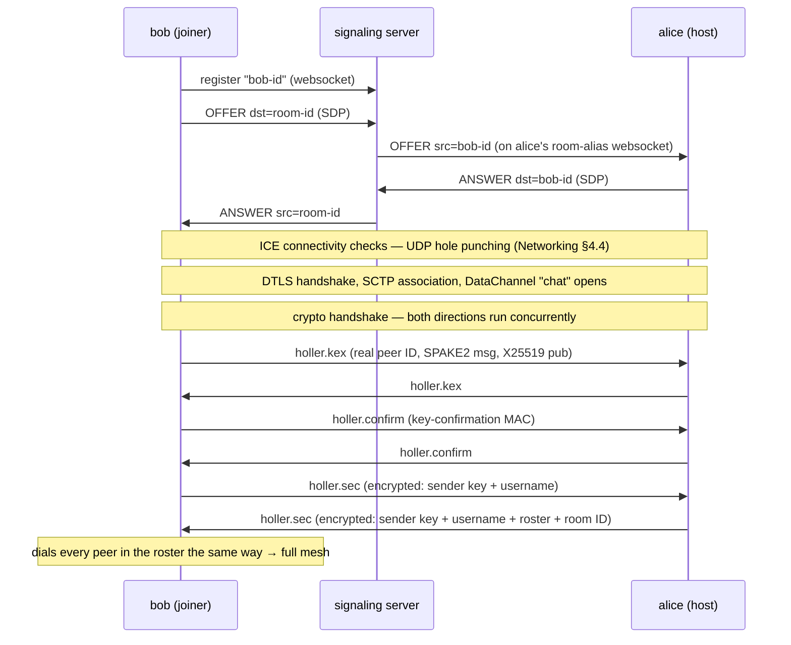

# A Tour of the Codebase

```
src/holler/
├── cli.py      # argument parsing, password prompt, wiring — ~60 lines
├── ui.py       # terminal front-end (prompt_toolkit + rich)
├── client.py   # the heart: Client — handshakes, gossip, membership, resilience
├── peer.py     # transport: PeerJS signaling + WebRTC connections (aiortc)
├── crypto.py   # primitives: PAKE handshake, AEAD seal/open, Lamport clock, seen-cache
└── errors.py   # typed exceptions
tests/
├── fakes.py        # in-memory fake transport implementing peer.py's interface
├── conftest.py     # fixtures: fast-timing clients wired to the fake transport
├── test_crypto.py  # unit tests for the primitives
├── test_client.py  # integration tests: real Clients over the fake transport
└── e2e_smoke.py    # live test against a real signaling server (not collected by pytest)
```

## The two central classes

**`peer.PeerConnection`** owns everything below encryption. It registers IDs with the
signaling server (one websocket per registered ID, each supervised with keepalives and
automatic reconnection), performs WebRTC offer/answer, and hands the layers above an
extremely small surface: `connect_to(id)`, `send_to(id, str)`, `broadcast(str)`,
`drop(id)`, and four callbacks (`on_message`, `on_peer_connected`,
`on_peer_disconnected`, `on_alias_lost`). It knows nothing about encryption or chat.

**`client.Client`** owns everything above the transport. It runs the cryptographic
handshake with every new channel, encrypts/decrypts and routes gossip envelopes,
tracks membership, elects the room holder, detects dead links and reconnects. It is
**headless**: all output is emitted through a single `on_event(kind, payload)`
callback, which is what makes the whole thing testable — the test suite runs real
`Client` instances over an in-memory fake transport and asserts on the events.

## Life of a join, end to end



## Life of a message

Sending (`Client.send_chat`): tick the Lamport clock → seal
`{text, wall-clock}` with **our** sender key using AES-256-GCM, binding the envelope
metadata (message ID, origin, Lamport time, kind) as associated data → record the
message ID in our own seen-cache → send the envelope on every ready channel.

Receiving (`Client._handle_gossip`): validate the envelope shape → drop if the
message ID is in the seen-cache (deduplication) → merge the Lamport timestamp →
decrypt with the *origin's* sender key → **re-broadcast to every other channel with
TTL−1** (this is the gossip step that routes around dead links — see
[Distributed Algorithms §6.1](Distributed-Algorithms#61-gossip-surviving-dead-links-with-proof))
→ insert into the log sorted by `(lamport, origin)` and emit a `chat` event for the UI.

## The background monitor

One task per client wakes every few seconds and does four cheap jobs: send a
`holler.ping` on every channel, mark links whose last inbound message is too old as
dead (starting the reconnection flow —
[Distributed Algorithms §6.3](Distributed-Algorithms#63-failure-detection-heartbeats-and-their-limits)),
expire stale typing indicators, and re-run the room-holder election
([Distributed Algorithms §6.4](Distributed-Algorithms#64-room-holder-election)) so a
lost room registration heals itself.

---

*Next: [NAT Traversal & Networking](NAT-Traversal-and-Networking) · Up: [Home](Home)*
