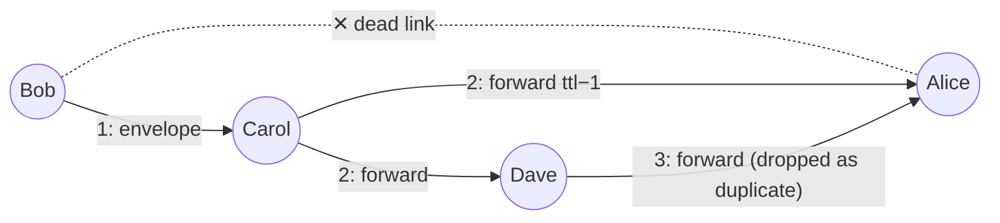
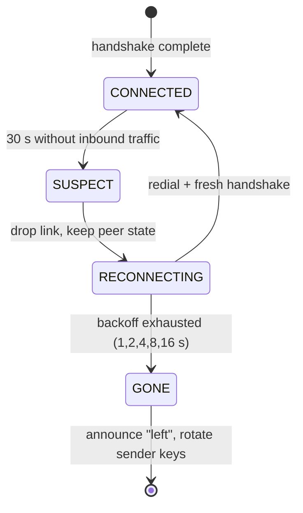

# Distributed Algorithms

The [crypto layer](Cryptography) secures *messages*; this page is about *the group* —
how messages reach everyone despite dead links, how everyone agrees what order things
happened in, and who holds the room ID. Holler is a real distributed system, just a
friendly-sized one.

## 6.1 Gossip: surviving dead links, with proof

Peers form a full mesh, but any individual link can silently die (NAT mapping
expired, Wi-Fi blip — see
[Networking §4.4](NAT-Traversal-and-Networking#44-udp-hole-punching-step-by-step)).
If messages travelled only on the direct author→reader link, a single dead link would
silently split the conversation. Holler instead **floods**:

```
On receiving envelope e via link L:
  1. if e.id in seen-cache        → drop        (termination / dedup)
  2. add e.id to seen-cache
  3. attempt decrypt & deliver     (failure to decrypt ⇒ drop, don't forward)
  4. if e.ttl > 1: forward e with ttl−1 to every ready link except L
```



**Theorem (delivery).** Model live links as an undirected graph `G`. If there is any
path from the author to peer `P` of length ≤ TTL, then `P` delivers the message
exactly once.

*Proof.* Induction on `d`, the length of the shortest author→P path.
Base `d = 1`: the author sends on all its links, including the one to `P`.
Step: assume every peer at distance `d` processes the envelope (first copy arrives
with TTL ≥ initial−d+1 > 1, by the same induction). `P` at distance `d+1` has a
neighbour `Q` at distance `d` on a shortest path; when `Q` processes its *first* copy,
step 4 forwards to all `Q`'s neighbours — including `P`. So `P` receives it. *Exactly
once* as in: later copies hit step 1 and are dropped; each peer therefore delivers and
forwards at most once. ∎

**Cost.** Each peer forwards once on each of its links, so one chat message causes at
most `2·|E|` transmissions — in a full mesh of `n` peers, O(n²) small packets. For a
chat room of humans (n ≤ dozens), negligible; this simplicity-over-bandwidth trade is
deliberate. (At thousands of nodes you'd switch to probabilistic gossip — forward to
`k` random neighbours — accepting probabilistic delivery for O(n log n) cost; see
Demers et al. below.)

**The details that make it safe in practice:**

- The **seen-cache** (`crypto.SeenCache`) is bounded — LRU by insertion with a time
  and size cap — so an unbounded set can't leak memory over a long session, and
  incidentally makes **replayed** envelopes (same ID) inert.
- **TTL = 8** bounds worst-case circulation of any single envelope. A full mesh has
  diameter 1; even after heavy link failure the surviving graph's diameter stays tiny,
  so 8 is generous headroom, not a tuning knob.
- **Decrypt-fail ⇒ don't forward**: a corrupted or forged envelope dies at the first
  honest hop rather than being amplified by the mesh
  ([Cryptography §5.4](Cryptography#54-aead-aes-256-gcm-and-associated-data)'s AAD
  makes the check airtight).

## 6.2 Ordering: Lamport clocks, with proof

With gossip, the same two messages can arrive at different peers **in different
orders** (different paths, different delays). Wall clocks can't arbitrate — machines'
clocks disagree by amounts far larger than a chat's inter-message gaps. The classic
fix (Lamport, 1978 — the most-cited paper in distributed systems) is to stop asking
"when" and ask "**what could have caused what**".

Define the **happened-before** relation `→` as the smallest transitive relation where
`a → b` if `a` precedes `b` in the same process, or `a` is the sending of a message
and `b` its receipt. Events with neither `a → b` nor `b → a` are *concurrent* — and
for concurrent events, *any* display order is defensible; what's unacceptable is
peers disagreeing, or an answer displaying before its question.

**Lamport clock:** each peer keeps an integer `t`. On every send: `t += 1`, stamp the
message with `t` (`LamportClock.tick`). On every receive of stamp `s`:
`t = max(t, s) + 1` (`LamportClock.update`).

**Theorem (clock condition).** `a → b ⟹ C(a) < C(b)`.

*Proof.* It suffices to check the two generating cases, since `<` on integers is
transitive. (i) Same process: every local event increments `t`, so later events get
strictly larger stamps. (ii) Message m sent at stamp `C(send) = s`: the receiver sets
its clock to `max(t, s) + 1 ≥ s + 1 > s`, so the receive event — and everything after
it at that peer — carries a stamp `> s`. ∎

The converse is deliberately false — `C(a) < C(b)` does *not* imply causality (that
would need **vector clocks**: a counter per peer, O(n) per message — overkill when we
only need a display order, not causality *detection*).

Lamport stamps can tie (two peers concurrently send at the same `t`), so holler sorts
the log by the pair **`(lamport, origin_id)`** — a total order (message IDs break the
impossible-in-practice remaining tie), and by the theorem it *extends* causality: if
one message could have influenced another, every peer displays them in that order,
and all peers' logs converge to the identical sequence regardless of arrival order.
Implementation: a `bisect.insort` into the bounded log in `client._append_log`, four
lines total. The wall-clock time in each message is a *display label* inside the
encrypted payload, never a sort key.

## 6.3 Failure detection: heartbeats and their limits

To reroute around dead links (and eventually declare a peer gone) you must first
*detect* death. Here distributed-systems theory delivers bad news: **in an
asynchronous network, a crashed peer and a slow peer are indistinguishable** — any
finite silence might end a millisecond after you give up. (This impossibility is a
cousin of the famous FLP theorem; "perfect" failure detectors don't exist, only
*eventually accurate* ones.)

So holler does the pragmatic, standard thing — a timeout-based detector, tuned
honest-to-its-purpose:

- every peer sends `holler.ping` on every channel every **5 s** (which also keeps the
  NAT hole of
  [Networking §4.4](NAT-Traversal-and-Networking#44-udp-hole-punching-step-by-step)
  from expiring — one mechanism, two jobs);
- *any* inbound traffic refreshes `last_seen`;
- silence beyond **30 s** (six missed pings) marks the link *suspect* — cheap
  insurance against a single dropped packet causing churn.

A suspect link is torn down and the **reconnection state machine** takes over:



One asymmetry prevents both sides redialling into each other (the "glare" problem):
**the peer with the lower ID redials; the higher waits** — the same deterministic
tie-break used at the transport layer, chosen because both sides can compute it with
zero coordination. A false suspicion costs one redial and a sub-second re-handshake
([Cryptography §5.7](Cryptography#57-pake-spake2-the-algorithm-that-fixes-passwords));
a true death is announced within ~a minute. Meanwhile gossip (§6.1) has been routing
that peer's messages around the dead link the whole time — detection latency never
silences anyone.

## 6.4 Room-holder election

The room ID must stay joinable as long as *anyone* is in the room, but it's just a
PeerJS registration
([Networking §4.9](NAT-Traversal-and-Networking#49-signaling-peerjs-and-how-holler-implements-all-of-this))
held by **one** peer at a time. Who? This is a leader election, and holler uses the
simplest correct rule in the book:

> **The peer with the lexicographically smallest real peer ID holds the room.**

Every membership change (and, as a self-healing backstop, every few monitor ticks)
each peer re-evaluates `min(my_id, all ready peers' ids) == my_id` and acquires or
releases the alias accordingly (`client._reevaluate_room_holder`).

**Why it's safe:** IDs are unique, so over any *agreed* set of live members exactly
one peer satisfies the rule — no coordination messages needed, everyone computes the
same answer locally (the reason a deterministic rule beats, say, "whoever grabs it
first"). During the transient where views *disagree* (a departure not yet noticed by
all), two peers may both believe they should hold — and here the signaling server
acts as the arbiter of last resort: a second registration of a taken ID is rejected,
so at most one holder exists at any instant regardless of local confusion.

**Why it's live:** when the holder leaves, its registration lapses; the new minimum's
next re-evaluation acquires the ID (with retries, since the old registration can take
a moment to expire server-side). Every survivor runs the same rule, so *someone*
always converges onto the room — which is exactly the property "the room outlives any
individual member".

---

> **Go deeper:** Lamport, *Time, Clocks, and the Ordering of Events in a Distributed
> System* (1978) — short and readable; Demers et al., *Epidemic Algorithms for
> Replicated Database Maintenance* (1987) — where gossip protocols come from;
> Kleppmann, *Designing Data-Intensive Applications* ch. 8–9 — the best modern
> treatment of clocks, failure detection, and why distributed systems are hard;
> Cachin, Guerraoui & Rodrigues, *Introduction to Reliable and Secure Distributed
> Programming* — failure detectors and broadcast, with proofs.

*Next: [Threat Model & Further Reading](Threat-Model-and-Further-Reading) · Up: [Home](Home)*
