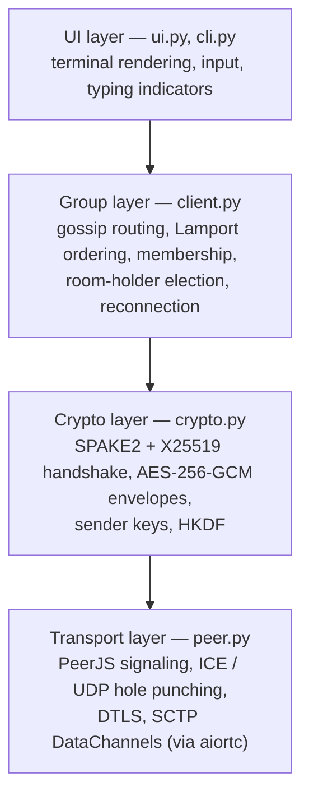

# The Holler Guide

**Everything you need to understand, run, and hack on holler — from first principles.**

This guide assumes you are a software engineer but assumes **zero background in
cryptography, networking internals, or distributed systems**. Every algorithm the app
uses is explained from the ground up: what problem it solves, how it works, why *this*
algorithm was chosen for *this* layer, and — where it's illuminating — a proof or proof
sketch of why it's correct.

> These pages are the project wiki, synced automatically from
> [`docs/wiki/`](https://github.com/SipanP/holler/tree/main/docs/wiki) on every push to
> `main`. To propose changes, edit those files in a pull request — direct wiki edits
> will be overwritten.

## Reading map

| Page | What's inside |
|---|---|
| [Quick Start](Quick-Start) | Install, create/join a room, every CLI flag, dev workflow |
| [Codebase Tour](Codebase-Tour) | The layers, the two central classes, life of a join, life of a message |
| [NAT Traversal & Networking](NAT-Traversal-and-Networking) | NAT from first principles, STUN, **UDP hole punching step by step**, TURN, ICE, WebRTC, signaling — and where each lives in the code |
| [Cryptography](Cryptography) | From XOR to AES-GCM, Diffie–Hellman with proof, the offline dictionary attack, **SPAKE2 with proof**, forward secrecy, sender keys — and why each algorithm guards each layer |
| [Distributed Algorithms](Distributed-Algorithms) | Gossip routing with a delivery proof, Lamport clocks with proof, failure detection, room-holder election |
| [Threat Model & Further Reading](Threat-Model-and-Further-Reading) | What holler does *not* protect against, and a curated reading list per topic |

## The big picture

Holler is a group chat where **no server can read, store, or forge your messages**.
Every participant's terminal connects *directly* to every other participant's terminal.
A tiny public "signaling" server is used for a few seconds to help peers find each
other — after that it is out of the picture entirely.

Getting there requires solving four independent problems, and the codebase is layered
around exactly those four:

| Problem | Solution | Where to read |
|---|---|---|
| Two machines behind home routers cannot accept connections | UDP hole punching, coordinated by ICE/STUN, wrapped in WebRTC | [NAT Traversal & Networking](NAT-Traversal-and-Networking) |
| Nobody but the group may read messages — not even the signaling server | A password-authenticated key exchange (SPAKE2) plus authenticated encryption (AES-256-GCM) | [Cryptography](Cryptography) |
| Links die; messages must still arrive, in a sensible order | Gossip flooding + Lamport clocks + heartbeat-driven reconnection | [Distributed Algorithms](Distributed-Algorithms) |
| A terminal app must stay usable while all this happens | An event-driven headless client with a prompt_toolkit front-end | [Codebase Tour](Codebase-Tour) |

**New to the project?** Read [Quick Start](Quick-Start) to get it running in two
minutes, then [Codebase Tour](Codebase-Tour) for orientation. The three deep-dive
pages stand alone and can be read in any order.
