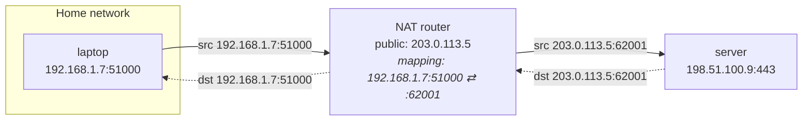
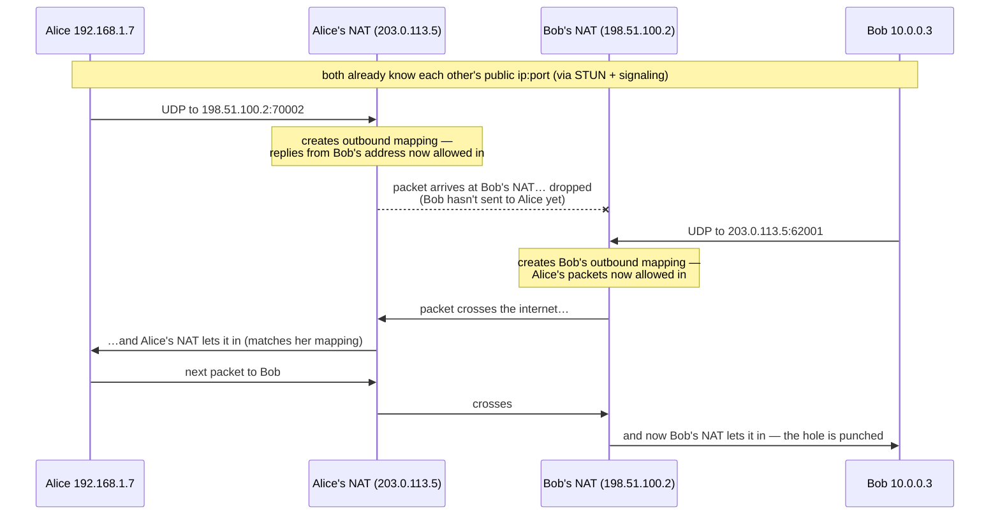

# Networking: Getting Two Machines to Talk Directly

This page explains, from first principles, how two laptops behind ordinary home
routers end up with a direct encrypted pipe between them — the problem NAT creates,
the UDP hole punching trick that solves it, and the STUN/TURN/ICE/WebRTC machinery
that makes the trick reliable. The final section maps every concept onto the exact
code in `src/holler/peer.py`.

## 4.1 The problem: NAT

The internet has ~4.3 billion IPv4 addresses and far more devices than that. The
workaround, deployed in practically every home and office router, is **Network Address
Translation (NAT)**: your whole network shares one public IP address, and your machines
get private addresses (`192.168.x.x`, `10.x.x.x`) that are meaningless outside.

When your laptop (`192.168.1.7`) sends a UDP packet from its local port `51000` to a
server, the router **rewrites** the source address to its own public IP and some port
it picks (say `203.0.113.5:62001`), and remembers the mapping:



Replies to `203.0.113.5:62001` are translated back and delivered to the laptop. But
here is the crucial property: **the mapping only exists because the laptop sent
something first**. An unsolicited packet from a stranger arrives at the router with no
matching mapping and is silently dropped. That is why "just listen on a port" doesn't
work for a P2P app — *both* peers are behind NATs, *neither* can accept an incoming
connection, and (a design constraint of holler) we never require accepting inbound TCP.

NAT is a router feature, not a protocol you can negotiate with. Everything in this
section is a technique for *tricking* two NATs into each thinking their own machine
started the conversation.

## 4.2 NAT behaviours: cone vs. symmetric

NATs differ in one detail that decides whether hole punching works: **how they choose
the public port, and who is allowed to send to it**.

- **Endpoint-independent mapping ("cone" NAT)** — the router reuses *the same* public
  port for a given internal `ip:port`, no matter where the traffic is going. Once
  `laptop:51000 → :62001` exists, packets the laptop sends to *anyone* leave from
  `:62001`. Filtering may still be restricted (only hosts you've already sent to may
  reply), but the *address* is stable and therefore shareable.
- **Endpoint-dependent mapping ("symmetric" NAT)** — the router allocates a *different*
  public port per destination. The port a STUN server observes is not the port your
  packets toward a peer will use, so telling the peer your STUN-observed address is
  useless. Common on corporate networks and some mobile carriers.

Hole punching (next two sections) works for cone NATs — the substantial majority of
home networks — and fails for symmetric ones, which is exactly why TURN
([§4.6](#46-turn-the-relay-of-last-resort)) exists.

## 4.3 STUN: learning your own public address

Your machine does not know what public `ip:port` its NAT assigned — the rewriting
happens outside it. **STUN** (Session Traversal Utilities for NAT, RFC 8489) is a
protocol of almost comic simplicity that fixes this: you send a UDP *Binding Request*
to a public STUN server, and the server replies with one piece of information — *the
source address it saw your packet come from*. That is, by construction, your public
mapping for this socket.

```
you → STUN server:   "what do I look like from out there?"
STUN server → you:   "203.0.113.5:62001"
```

An address learned this way is called a **server-reflexive candidate**. Holler uses
Google's free public STUN server by default (`stun:stun.l.google.com:19302`,
overridable with `--stun`). STUN servers are stateless, handle one round trip per
query, and see no user data — running your own is trivial.

## 4.4 UDP hole punching, step by step

Now the trick itself. Alice and Bob are both behind cone NATs. Both have learned their
public addresses via STUN, and have exchanged them through the signaling server
(which they *can* both reach, because outbound connections always work).



Why this works, reasoned from the NAT's point of view: a NAT's job is to let *replies*
in. It cannot actually tell a reply from an unsolicited packet — all it checks is
"did my host recently send a packet to this remote `ip:port` from this local port?".
So when **both sides transmit at roughly the same time**, each side's first packet
plays the role of "opening the door" (creating the outbound mapping) and each side's
*subsequent* packets play the role of "replies" that fit through the other's open
door. The first packet in each direction is typically lost — that is expected and
harmless, because both sides keep retransmitting until one gets through.

Three practical notes:

1. **Timing needs coordinating.** Both sides must be trying at once — which is
   precisely what the signaling server arranges (it delivers the "start now, here are
   my addresses" messages).
2. **Mappings expire.** NATs forget idle UDP mappings after seconds to minutes, which
   is one of the two reasons holler heartbeats every open channel forever
   ([Distributed Algorithms §6.3](Distributed-Algorithms#63-failure-detection-heartbeats-and-their-limits))
   — the traffic keeps the hole open.
3. **Same-network shortcut.** If both peers are on the same LAN, their *private*
   addresses work directly; hole punching machinery still runs but the local route
   wins. This is why candidates of several types are tried in parallel
   ([§4.7](#47-ice-hole-punching-systematised)).

## 4.5 Why UDP and not TCP

TCP's handshake is stateful and asymmetric: one side `listen()`s, the other
`connect()`s, and the kernel tracks sequence numbers from the first SYN. Punching a
hole requires *both* sides to initiate simultaneously, which in TCP-land means a
"simultaneous open" — a rarely-exercised corner of the protocol that many NATs and
OS stacks handle badly. UDP has no connection state at all: a mapping is just
"forward things that look like replies", which is trivially compatible with both
sides blasting packets at each other.

So the entire P2P world (WebRTC included) settled on: **punch with UDP, then build
reliability on top of it in userspace**. Reliability, ordering, and congestion
control come back at a higher layer — in WebRTC's case via SCTP
([§4.8](#48-the-webrtc-stack-sdp-dtls-sctp)). This also satisfies holler's design
constraint that peers never accept inbound TCP.

## 4.6 TURN: the relay of last resort

When at least one side is behind a symmetric NAT ([§4.2](#42-nat-behaviours-cone-vs-symmetric)),
punching fails — there is no stable public address to share. The fallback is **TURN**
(Traversal Using Relays around NAT, RFC 8656): a server that both peers connect *out*
to, which relays their traffic. This sacrifices the "no server in the message path"
property for that connection — but crucially **not confidentiality**: everything a
TURN server relays is DTLS ciphertext, and inside that, holler's own AES-GCM
ciphertext. The relay learns who talks to whom and how much, never what.

Holler does not ship a default TURN server (running a relay costs real bandwidth);
you pass your own with `--turn turn:your.server:3478 --turn-user u --turn-pass p`.
[coturn](https://github.com/coturn/coturn) on a small VPS is the standard choice.
TURN-over-TCP exists but holler deliberately configures relays over UDP only, keeping
the no-inbound-TCP constraint intact.

## 4.7 ICE: hole punching, systematised

Real networks are messy: maybe you're on the same LAN, maybe one side has a public IP,
maybe punching works, maybe only TURN does. **ICE** (Interactive Connectivity
Establishment, RFC 8445) is the algorithm that tries everything and picks the best
thing that works:

1. **Gather candidates** — each peer collects every address it might be reachable at:
   - *host* candidates (its own interface addresses — work on the same LAN),
   - *server-reflexive* candidates (public addresses learned via STUN, [§4.3](#43-stun-learning-your-own-public-address)),
   - *relayed* candidates (TURN allocations, if configured).
2. **Exchange them** through the signaling channel.
3. **Connectivity checks** — form all candidate pairs, sort by priority
   (host > reflexive > relayed), and send STUN Binding Requests directly between the
   pair addresses. **These probe packets, fired by both sides at once, are the UDP
   hole punching of §4.4** — ICE is not an alternative to hole punching, it *is* hole
   punching plus bookkeeping.
4. **Nominate** — the first/best pair whose check succeeds in both directions becomes
   the path; everything else is torn down.

## 4.8 The WebRTC stack: SDP, DTLS, SCTP

WebRTC bundles the whole stack above and adds transport security and reliability.
Holler uses [aiortc](https://github.com/aiortc/aiortc), a Python implementation.
From the bottom up, a holler DataChannel is:

```
UDP                      ← what actually crosses the NATs (§4.4)
 └─ ICE                  ← path selection & keepalive of the punched hole (§4.7)
     └─ DTLS             ← TLS for datagrams: encrypts everything above
         └─ SCTP         ← reliability, ordering, multiplexing — TCP-like semantics in userspace
             └─ DataChannel "chat"   ← the message pipe holler reads/writes
```

- **SDP** (Session Description Protocol) is the *offer/answer* document peers exchange
  through signaling: it lists ICE candidates, the DTLS certificate fingerprint, and
  SCTP parameters. Holler waits for ICE gathering to finish and sends one complete SDP
  per direction ("vanilla ICE") rather than trickling candidates one by one — slightly
  slower to connect, much simpler to relay through PeerJS.
- **DTLS** is TLS adapted to datagrams. Each peer generates a throwaway self-signed
  certificate; its fingerprint travels inside the SDP. That means DTLS's authenticity
  is only as trustworthy as the signaling channel that carried the fingerprint — the
  precise gap holler's own crypto layer closes
  ([Cryptography §5.6](Cryptography#56-the-man-in-the-middle-problem-and-why-passwords-are-hard)).
- **SCTP** gives back what UDP took away — retransmission, in-order delivery,
  message framing — without needing OS/NAT cooperation, because it runs *inside* the
  DTLS packets in userspace.

## 4.9 Signaling, PeerJS, and how holler implements all of this

Two peers can't exchange SDPs over a connection that doesn't exist yet — someone
reachable-by-both must carry the first few messages. That someone is the **signaling
server**. Holler speaks the open [PeerJS](https://peerjs.com/) protocol: each peer
opens a websocket and registers an ID; the server's only job is forwarding small JSON
envelopes (`OFFER`, `ANSWER`, heartbeats) between IDs. It is on the path for a few
seconds per connection and never sees anything but SDPs — and thanks to SPAKE2
([Cryptography §5.7](Cryptography#57-pake-spake2-the-algorithm-that-fixes-passwords)),
even a *malicious* signaling server cannot break into the chat.

Everything in this section lives in **`src/holler/peer.py`**:

| Concern | Where | Notes |
|---|---|---|
| Candidate/STUN/TURN config | `build_ice_servers()` | fed to aiortc's `RTCConfiguration`; `--stun`/`--turn` flags land here |
| Vanilla ICE | `_wait_for_ice()` | block until gathering completes, then ship one SDP |
| Offer/answer | `_send_offer()`, `_handle_offer()`, `_handle_answer()` | plus a deterministic tie-break when both sides dial simultaneously ("glare"): the lexicographically lower peer ID stays the offerer |
| Registration keepalive | `_heartbeat()` | the PeerJS server expires clients that don't ping every few seconds — the *client* must send heartbeats |
| Signaling resilience | `_supervise()` | every registered ID's websocket auto-reconnects with exponential backoff and re-registers |
| Fast failure | `_fail_pending()` | a `LEAVE`/`EXPIRE` from the server immediately fails a pending dial instead of waiting out a 30 s timeout |
| **Room IDs** | `register_alias()` | the trick that gives holler stable rooms: the room ID is just a *second* PeerJS registration held by one member. Offers addressed to the room land on whichever peer holds it. Who holds it is decided by the election in [Distributed Algorithms §6.4](Distributed-Algorithms#64-room-holder-election) |

The public `0.peerjs.com` server is the default so that holler works out of the box,
but `--signaling` accepts any PeerJS-compatible server — self-hosting is one line
(`npx peer --port 9000`) and removes the third-party dependency and its metadata view
([Threat Model](Threat-Model-and-Further-Reading)).

---

> **Go deeper:** Ford, Srisuresh & Kegel, *Peer-to-Peer Communication Across Network
> Address Translators* (2005) — the classic hole-punching paper. Tailscale's
> [*How NAT traversal works*](https://tailscale.com/blog/how-nat-traversal-works) —
> the best modern treatment. [*WebRTC for the Curious*](https://webrtcforthecurious.com/)
> — a free book on the whole stack. RFCs: 8445 (ICE), 8489 (STUN), 8656 (TURN),
> 8831 (data channels).

*Next: [Cryptography](Cryptography) · Up: [Home](Home)*
